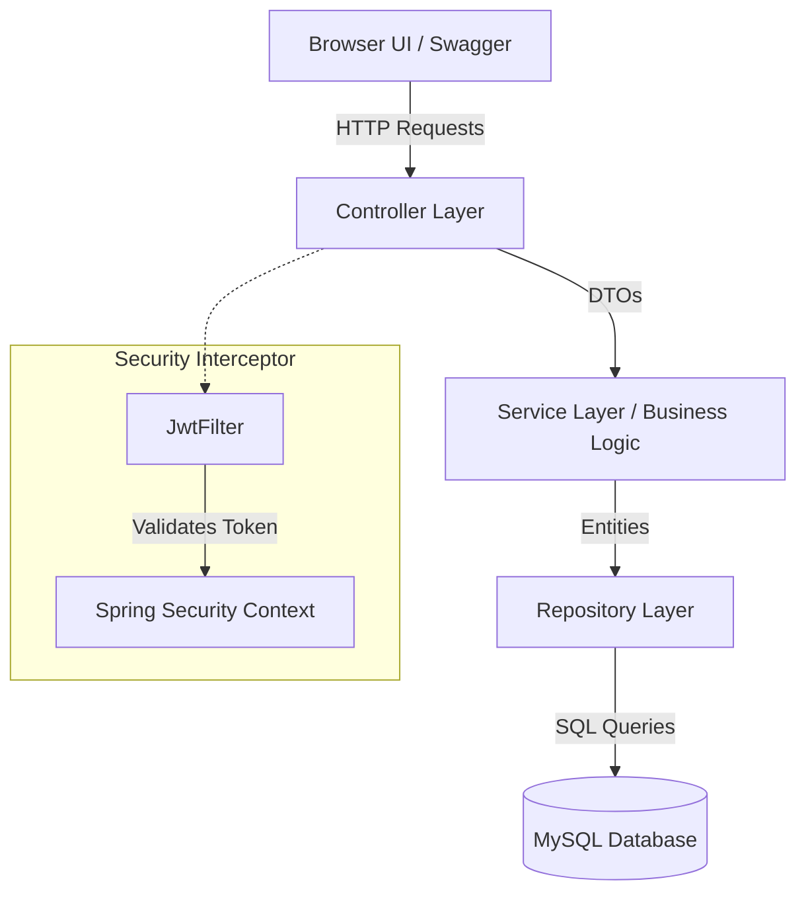

# Fundoo Notes - Premium Personal Note Manager

An interactive, secure, and production-grade Single Page Application (SPA) and RESTful API backend designed to manage notes, checklists, labels, collaborators, and reminders. Built with a clean **Spring Boot 3 layered architecture**, **Spring Security (JWT)**, **MySQL**, and a glassmorphic client frontend.

---

## Table of Contents
1. [Tech Stack & Utilization](#1-tech-stack--utilization)
2. [Architectural Design](#2-architectural-design)
3. [Key Features](#3-key-features)
4. [API Specification & Samples](#4-api-specification--samples)
5. [Database Schema](#5-database-schema)
6. [Interactive SPA Frontend](#6-interactive-spa-frontend)
7. [Installation & Setup](#7-installation--setup)
8. [Docker Deployment](#8-docker-deployment)
9. [Developer Modes & Verification](#9-developer-modes--verification)

---

## 1. Tech Stack & Utilization

| Technology | Layer / Purpose | Why It Was Chosen & How It Is Used |
| :--- | :--- | :--- |
| **Java 17** | Core Language | Modern LTS release offering robust performance, records, and pattern matching. Used without Lombok to prevent JDK 26 preview compiler crashes. |
| **Spring Boot 3.2.5**| Framework | Core framework providing dependency injection, autoconfiguration, embedded Tomcat, validation, and REST API controller layers. |
| **Spring Security** | Security | Handles authentication and authorization. Configured to intercept all `/api/v1/notes/**`, `/api/v1/labels/**`, etc. |
| **JSON Web Token (JWT)**| Stateless Auth | Generates secure 256-bit encrypted access tokens upon login. Validated on subsequent requests via a custom filter. |
| **Spring Data JPA** | Data Access | Simplifies database interactions using repositories, custom query methods, and JPA Specifications for dynamic search. |
| **MySQL 8** | Database | Relational database hosting schemas for users, notes, labels, collaborators, and reminders. |
| **Flyway Migration** | Database Versioning| Automates database schema creation and updates using SQL scripts (`V1__init_schema.sql`). |
| **Spring Doc (OpenAPI)**| API Docs / Swagger | Generates interactive Swagger UI documentation at `/swagger-ui.html` mapped with JWT Bearer Authentication. |
| **Vanilla HTML5 & CSS3**| SPA Client | Glassmorphic, modern dark-themed user interface. Free from heavy framework overhead to serve fast from Spring's static folder. |
| **Vanilla JS (ES6)** | SPA Client Logic | Handles AJAX Fetch API calls, token persistence (`localStorage`), state management, and real-time DOM updates. |

---

## 2. Architectural Design

The codebase follows the industry-standard **Layered (N-Tier) Architecture** to ensure clean separation of concerns, easy testability, and high maintainability:



### Module Descriptions
- **Config Layer** (`config`): Configures JWT filtering, CORS policies, Swagger OpenAPI descriptions, and security permissions (permitting public registration/login/verification).
- **Controller Layer** (`controller`): Exposes REST APIs, mapping input paths under `/api/v1/...`, validating DTO request bodies.
- **Service Layer** (`service`): Implements core business logic, checks permission states (Collaborators vs Owners), and handles scheduled crons.
- **Repository Layer** (`repository`): Handles Hibernate JPA queries and Specification filters.
- **Entity Layer** (`entity`): Models mapped database tables (`User`, `Note`, `Label`, `Collaborator`, `Reminder`).
- **DTO Layer** (`dto`): Validates incoming JSON parameters (email structure, custom password rules) and maps sanitised output structures.

---

## 3. Key Features

### 🔐 JWT Authentication & Activation Helper
- Account creation requires verification. A link containing a JWT token is generated.
- **Developer Helper**: Because mail transfer agents are locally blocked, the system logs verification tokens directly to the console. The SPA dashboard includes an activation field to paste and activate the account directly.

### 📝 Rich Note Management (Google Keep Inspired)
- **Pinning**: Pinned notes float to a dedicated section at the top of the interface.
- **Archiving**: Moves notes into a secondary stream to keep the active dashboard clean.
- **Trashing**: Soft deletes notes. A daily background scheduler sweeps notes trashed longer than 30 days and purges them permanently.
- **Dynamic Styling**: Color notes dynamically (supports white, blue, green, yellow, red, purple, orange, pink).

### 🏷️ Dynamic Labels Manager
- Create custom categorisation labels.
- Attach multiple labels to notes. Custom label-specific filters are rendered in the navigation panel.

### 🤝 Secure Collaboration
- Share notes with multiple users.
- Roles: `VIEWER` (read-only) or `EDITOR` (can modify note content).
- Access control checks are done at the service layer: only the owner can manage collaborators, but editors can save note content changes.

### ⏰ Snoozable Reminders
- Schedule timestamps for notifications.
- Background scheduler triggers every minute, sending emails to notify users when reminders expire.

---

## 4. API Specification & Samples

Below are sample JSON request/response formats for core endpoints:

### User Registration
- **URL**: `POST /api/v1/users/register`
- **Request Payload**:
```json
{
  "firstName": "John",
  "lastName": "Doe",
  "email": "john.doe@example.com",
  "mobileNumber": "9876543210",
  "password": "Password@123"
}
```
- **Response**:
```json
{
  "success": true,
  "message": "User registered successfully. Please verify your email.",
  "data": {
    "id": 1,
    "firstName": "John",
    "lastName": "Doe",
    "email": "john.doe@example.com",
    "mobileNumber": "9876543210",
    "verified": false,
    "profilePic": null,
    "createdAt": "2026-06-12T12:00:00"
  }
}
```

### User Login
- **URL**: `POST /api/v1/users/login`
- **Request Payload**:
```json
{
  "email": "john.doe@example.com",
  "password": "Password@123"
}
```
- **Response**:
```json
{
  "success": true,
  "message": "Login successful",
  "data": {
    "token": "eyJhbGciOiJIUzI1NiJ9.eyJzdWIiOiJ...",
    "user": {
      "id": 1,
      "firstName": "John",
      "lastName": "Doe",
      "email": "john.doe@example.com"
    }
  }
}
```

### Create Note (Authenticated)
- **URL**: `POST /api/v1/notes`
- **Headers**: `Authorization: Bearer <token>`
- **Request Payload**:
```json
{
  "title": "Weekly Agenda",
  "description": "Plan Spring Boot sprint reviews and frontend integration tasks.",
  "color": "blue",
  "pinned": true,
  "archived": false,
  "trashed": false
}
```
- **Response**:
```json
{
  "success": true,
  "message": "Note created successfully",
  "data": {
    "id": 12,
    "title": "Weekly Agenda",
    "description": "Plan Spring Boot sprint reviews and frontend integration tasks.",
    "color": "blue",
    "pinned": true,
    "archived": false,
    "trashed": false,
    "ownerId": 1,
    "labels": [],
    "collaborators": [],
    "reminders": []
  }
}
```

---

## 5. Database Schema

The database is powered by MySQL, managed in real-time by **Flyway Migrations**:

```
+------------------+         +-------------------+
|      users       |         |       notes       |
+------------------+         +-------------------+
| id (PK)          |<--------| owner_id (FK)     |
| email (Unique)   |         | id (PK)           |
| password         |         | title             |
| first_name       |         | description       |
| last_name        |         | color             |
| verified         |         | pinned            |
+------------------+         | archived          |
                             | trashed           |
                             +-------------------+
                                   |       ^
         +-------------------------+       |
         |                                 |
         v                                 v
+------------------+             +-------------------+
|  collaborators   |             |     reminders     |
+------------------+             +-------------------+
| id (PK)          |             | id (PK)           |
| note_id (FK)     |             | note_id (FK)      |
| user_id (FK)     |             | remind_at         |
| role (VARCHAR)   |             | notified (BOOL)   |
+------------------+             +-------------------+
```

---

## 6. Interactive SPA Frontend

The frontend resources are located under `src/main/resources/static`.
- **Aesthetics**: Glassmorphic dashboard tiles, customizable card colors, smooth slide-ins, and animated loading/toggle transitions.
- **Client Controller (`app.js`)**:
  - Implements complete token checks (`localStorage.getItem('fundoo_token')`).
  - Fetches and renders note grids dynamically.
  - Automatically updates note details locally and syncs back to the backend.
  - Contains inline modular triggers to launch label controls and collaborators list editors.

---

## 7. Installation & Setup

### Prerequisites
1. **JDK 17** installed.
2. **MySQL Server** installed and running on port `3306`.

### Step 1: Create Database
Run the following SQL in your MySQL client to prepare the schema container:
```sql
CREATE DATABASE IF NOT EXISTS fundoo_db;
```

### Step 2: Configure Properties
Edit `src/main/resources/application.properties` with your database credentials:
```properties
spring.datasource.url=jdbc:mysql://localhost:3306/fundoo_db?useSSL=false&serverTimezone=UTC&createDatabaseIfNotExist=true
spring.datasource.username=root
spring.datasource.password=root123
```

### Step 3: Run the Application
Start the Spring Boot application using Maven:
```bash
mvn spring-boot:run
```
The server will start at `http://localhost:8080/`.

---

## 8. Docker Deployment

If you prefer using Docker to run both MySQL and the Spring Boot application:

1. **Build and Run**:
```bash
docker-compose up --build -d
```
2. **Check Status**:
```bash
docker-compose ps
```
The backend automatically waits for the MySQL container health checks before launching and migrating schemas.

---

## 9. Developer Modes & Verification

### Inline account activation
Because local dev environments typically block external email relays, check your IDE command line / IntelliJ output for verification logs:
```
[DEVELOPER MODE] Verification token for user@example.com: a2c18d5b-f3e0...
```
1. Copy the token.
2. Paste it in the UI's verification token field to activate your account instantly.

### Interactive Swagger UI docs
Access interactive Swagger documentations to test API paths manually:
- URL: `http://localhost:8080/swagger-ui/index.html`
- Authenticate by pressing **Authorize** at the top right and inserting your login token: `Bearer <token>`
